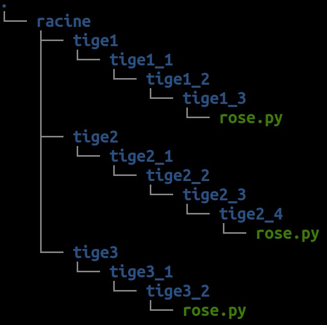

# ROS4PRO : Journée d'Introduction
## 1. Légende et prérequis

Les travaux pratiques ROS4PRO nécessitent que vous fassiez "booter" votre poste de travail sur la clé USB Live fournie ou bien que vous ayez vous même installé Ubuntu 18.04 et ROS Melodic. Les pictogrammes suivants sont utilisés :

* 💻 : Procédure exécuter sur votre poste de travail Ubuntu
* 🤖 : Procédure à exécuter sur le robot, en utilisant SSH
* 📀 : Cette procédure est déjà faîte pour vous si vous lancez Ubuntu via une clé USB Live
* 🐍 : Code Python à enregistrer et exécuter sur votre poste de travail
* 📥 : Ressource à Télécharger
* ✍ : Répondre aux questions par écrit

## 2. Prise en main du terminal : le rosier 🌹
⌨️ Pour prendre en main le terminal Linux et les commandes de base, à partir d'un terminal, créez les fichiers et dossiers nécessaires pour réaliser cette hierarchie de fichiers ressemblant à un rosier :



Vous aurez besoin des commandes suivantes :
* `ls`, pour lister les fichiers et dossiers courants
* `cd`, pour changer le dossier courant
* `mkdir`, pour créer un nouveau dossier
* `touch`, pour créer un nouveau fichier vide
* `nano`, pour créer un nouveau fichier et écrire à l'intérieur
* `tree`, pour afficher la hierarchie de fichiers

## 3. Tutoriels

🧑‍🏫 Vous êtes désormais prêt à utiliser ROS ! Suivez les tutoriels ROS suivants pour découvrir et tester les concepts de base :

* [Understanding ROS Nodes](http://wiki.ros.org/ROS/Tutorials/UnderstandingNodes) : Maîtriser ROS master (`roscore`) et lancer des nœuds (`rosrun`)
* [Understanding ROS Topics](http://wiki.ros.org/ROS/Tutorials/UnderstandingTopics) : Envoyer et recevoir des messages dans un topic (`rostopic`)
* [Understanding ROS Services and Parameters](http://wiki.ros.org/ROS/Tutorials/UnderstandingServicesParams) : Déclarer et appeler un service requête/réponse (`rosservice`, `rossrv`)

❓ **Quizz** : quizz au tableau pour mémoriser les commandes importantes

## 4. FAQ Robots
### 🖧 Connexion via SSH à un robot
SSH (Secure SHell) permet d'ouvrir un terminal à distance sur une autre machine que celle sur laquelle on tape les commandes (par exemple le robot, qui n'a ni clavier ni écran pour interagir avec un terminal). Il est nécessaire de connaître :
* Le nom de la machine distante (par ex `poppy.local` ou `raspberrypi.local`)
* Le nom d'utilisateur propriétaire de la session sur laquelle ouvrir un terminal (toujours `pi` dans notre cas)
* Le mot de passe de cette session (`turtlebot` ou `poppy` dans notre cas)

La commande est la suivante, à taper dans un terminal sur Ubuntu :
```bash
ssh pi@poppy.local
```
Taper `yes` pour confirmer la connexion puis taper le mot de passe. 

### 🌈 Personnalisation des noms de robots et ordinateurs

Au démarrage du TP, tous les robots et les ordinateurs possèdent le même nom à savoir `ubuntu` (votre ordinateur), `poppy` (le robot manipulateur), `turtlebot` (le robot roulant), ce qui posera problème lorsqu'on les fera communiquer ensemble. Pour ces 3 machines, nous allons donc changer leur nom, en ajoutant juste votre numéro de groupe à la fin, par exemple `poppy5`.

💻🤖 Pour personnaliser votre nom, il faut ouvrir un terminal sur la machine à renommer (via SSH pour les robots) puis :
```bash
sudo hostnamectl set-hostname <NOUVEAU_NOM>
```

### 📥 Préparer les cartes SD (Flasher les cartes SD)
Note préliminaire : les cartes SD des robots ne se comportent pas tout-à-fait comme des cartes SD "normales". Elles ne permettent pas de stocker des fichiers dessus ; il est également normal qu'une carte SD insérée dans votre ordinateur n'apparaisse pas dans le Poste de Travail avant de l'avoir flashée. 

Téléchargez ces images ROS en vue de remettre à zéro les cartes SD des robots pour ROS4PRO (⚠️⏳ Optimisez votre temps, le téléchargement peut prendre 1 heure) :
* [Image du Turtlebot pour ROS4PRO](https://github.com/ros4pro/turtlebot3/releases/download/1.0/turtlebot3-ros4pro.7z)
* [Image de Poppy Ergo Jr pour ROS4PRO](https://github.com/poppy-project/poppy_controllers/releases/download/v1.0/poppy-ergo-jr-ros-melodic.img.zip)

Pour flasher l'une de ces images sur une carte SD :
* extrayez le fichier compressé **.zip** ou **.7z** (généralement clic droit > Extraire) dans un dossier de votre ordinateur (pas sur la carte SD) : vous obtenez un fichier d'extension **.img**
* ⚠️ **ne faîtes pas** de glisser-déposer ni de copier-coller de cette image vers la carte SD comme s'il s'agissait d'une clé USB : Il est nécessaire d'utiliser un logiciel de flash comme Etcher ou dd
* Tapez la commande `etcher` sur Ubuntu pour ouvrir l'utilitaire de flash (ou bien [téléchargez Etcher](https://www.balena.io/etcher/) s'il n'existe pas encore)
* Dans Etcher, "Flash from file", sélectionnez le fichier image ainsi que la destination (la carte SD) et validez
* Le flash de la carte SD est en cours ... ⚠️⏳ Optimisez votre temps, la copie dure environ 15 minutes. Dès qu'Etcher a terminé, votre carte SD est prête à être configurée pour le Wifi et/ou insérée dans le robot

Optionnellement, en cas de besoin de restaurer les robots avec les images d'usine, voici les liens (mais ces images ne sont pas utilisables avec ROS4PRO) :
* [Image d'usine du Turtlebot](http://www.robotis.com/service/download.php?no=1738) (pas de namespace complet, n'inclut pas la posibilité d'intégrer plusieurs robots)
* [Image d'usine de Poppy Ergo Jr](https://github.com/poppy-project/poppy-ergo-jr/releases/download/2.0.0/2017-04-06-poppy-ergo-jr.img.zip) (avec l'interface graphique `http://poppy.local` mais sans ROS)

### 🔧 Procédure de diagnostic
💻 Dans un terminal taper `ping poppy.local` (pour Poppy) ou `ping raspberrypi.local` (pour Turtlebot) :

  * **Si 1 ligne s'affiche chaque seconde** avec des statistiques de temps en millisecondes ➡️ Test réseau réussi. Vous avez peut-être oublié de démarrer le roscore ou bien `ROS_MASTER_URI` dans le fichier `~/.bashrc` pointe vers le mauvais robot
  * **Si une erreur survient** et la commande s'arrête ➡️ Test réseau échoué. Vérifiez que la LED verte ACT de la Raspberry Pi vacille pendant environ 45 secondes lorsque vous venez de brancher l'alimentation :
    * **Si `ACT` vacille** en 🟢 ➡️ Votre Raspberry Pi démarre correctement mais la configuration réseau est incorrecte. Vérifiez que vous avez placé le fichier `wpa_supplicant.conf` au bon endroit dans la partition `boot` sur la carte SD si vous êtes en Wifi ; ou bien connectez-vous avec un câble RJ45 sur un routeur
    * **Si `ACT` ne vacille pas** ➡️ Votre Raspberry Pi ne démarre pas correctement. La LED rouge `PWR` s'allume-t-elle ?
      * **Si `PWR` s'allume** en 🔴 ➡️ Votre Raspberry Pi est fonctionnelle mais la carte SD ne possède pas une image valable. Recommencez la procédure de flash ci-dessus.
      * **Si `PWR` ne s'allume pas** ➡️ Votre Raspberry Pi  n'est pas fonctionnelle. Vous avez peut-être mal branché la Pixl (Poppy) ou bien le câble rouge-noir (Turtlebot)

### 📡 Connecter le robot en Wifi
1. Insérer la carde SD du robot en question dans votre poste de travail et ouvrir la partition nommée `boot`, y télécharger le fichier [wpa_supplicant.conf](files/wpa_supplicant.conf) en indiquant le bon mot de passe wifi à l'intérieur mais sans changer son nom.

2. Créer un fichier vide nommé `ssh` au même endroit dans `boot` (par exemple avec la commande `touch ssh`)

3. Taper la commande `sync` avant de pouvoir retirer la carte SD.

Ces fichiers seront supprimés au prochain démarrage du robot, signalant que la demande de connexion Wifi a bien été prise en compte. En cas de problème, connecter un écran HDMI à la Raspberry Pi, le gestionnaire réseau se trouve en haut à droite.

### 🔔 Mon Turtlebot bipe
🔋 Il s'agit du signal de batterie faible et il ne doit pas être ignoré.

Turtlebot est alimenté par une batterie puissante de type Li-Po. Ce type de batterie rend dangereux leur utilisation lorsque la charge est très faible. Dans un cas extrême elle pourrait chauffer et prendre feu. Mettre en charge rapidement la batterie lorsque Turtlebot bipe.

### 🔑 Mots de passe par défaut
#### Turtlebot
* Nom d'utilisateur `pi`
* Nom de machine `raspberrypi` (ajouter `.local` dans les commandes)
* Mot de passer `turtlebot`

#### Poppy
* Nom d'utilisateur `pi`
* Nom de machine `poppy` (ajouter `.local` dans les commandes)
* Mot de passer `raspberry`

### 📥 Mise à jour pendant le TP
Il se peut que l'enseignant mette à jour les ressources pendant le cours. Dans ce cas exécutez les commandes suivantes pour récupérer les dernières mises-à-jour :
```bash
roscd ros4pro
git pull origin poppy_tb3_keras
```
Si l'erreur suivante survient :
```
error: Vos modifications locales aux fichiers suivants seraient écrasées par la fusion :
	<LISTE DE FICHIERS>
Veuillez valider ou remiser vos modifications avant la fusion.
Abandon
```
Alors les fichiers spécifiés ne peuvent pas être mis à jour car cela détruirait les modifications que vous avez apportées à la liste des fichiers indiquée. Il est recommandé de demander conseil avant d'essayer une autre action pour récupérer la mise à jour.
